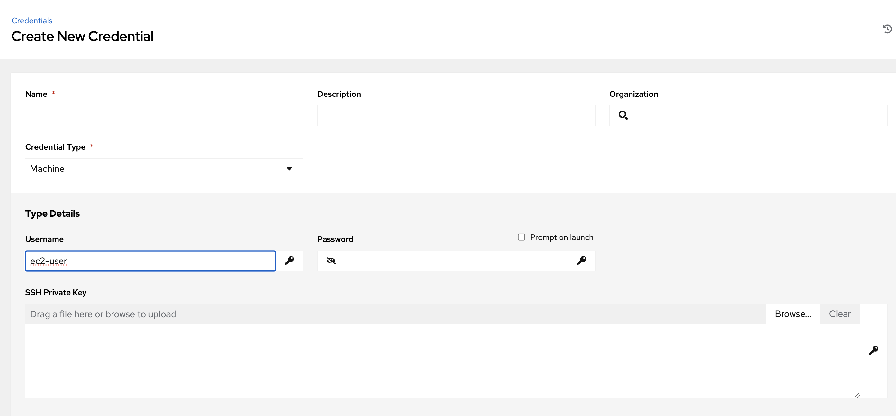

# Ansible Cloud App Deployment

#### Objective

The purpose of this project is to show that Ansible and Terraform aren't competitor but ally. Using them together we will hightlight how easily you can automate your cloud infrastructure on the different cloud provider with minimal change to your automation code.

#### Ansible & Terraform 

Ansible and Terraform are both great automation tools which have different ways of looking at automation. And ochestrationg them together make for a great solution in automations.

* [Terraform](https://www.terraform.io/)
  * Great at defining what the state of the infrstructure needs to be. The states get maintain in time.
  * Excels as a `cloud intrasctructure` provisioning tool
  * Define the entirety of the instrasctucture
* [Ansible](https://www.ansible.com/)
  * Task base oriented
    * easy way to get use to, since it translate to what we are doing on a day 2 day fashion
  * Great for orchestration multiple teams and technologies in to a single IT worksflow. ex: Window, Linux, Network, API ....
  * Cross-domain automation solution

---
#### Demo

Using Ansible and Terraform we will be deploying VM(s) in the cloud in order to deploy a Web Application inside a Web Server. The demo contains a load balancer to sent traffic to the different VM and a interfacing with ServiceNow to act as the client portal to order the different VM. We could implement other element in serviceNow such as incident management and Inventory.

###### Infrastructure
For the complete demo we wil be using 3 cloud providers. The demo is build so you can elect to select only the cloud infrastructure you want.

* [AWS](https://aws.amazon.com/)
* [Microsoft Azure](https://azure.microsoft.com/en-ca)
* [Google Cloud Platform](https://cloud.google.com/)

###### Prerequisite
* For local development
  * _Ansible_ core 2.16.x
  * _Terraform_
  * Python 3.x
  * [Red Hat JBoss]()
* [Github](https://github.com/) 
* [Ansible Automation Platform](https://www.redhat.com/en/technologies/management/ansible)
* Fork of the [Web Application Repository]()
* _Optional_ [ServiceNow](https://www.servicenow.com/)

:warning: The required variable need to be set in order to create the load balancer in the proper cloud.[Set variable here]().

Implementation diagram:

---

#### Build the demo.

For the demo we need and execution environment, you can find the info on how to create or find  [execution environment here](ansible/execution-env/README.md)

##### Preparation work.

###### AWS
* Ansible connects to EC2 instance using SSH. Let's start by creation a new [Key pair in AWS](https://docs.aws.amazon.com/servicecatalog/latest/adminguide/getstarted-keypair.html). 

* Create key pair, call `ansible_terraform_demo`

:warning: if you change the name you need to edit the terraform main  file with the new name.

* Create a credential in AAP which contains the SSH key for the user `ec2-user`

###### Azure

###### Steps

1. Configure [AWS dynamic inventory](https://www.redhat.com/en/blog/configuring-an-aws-dynamic-inventory-with-automation-controller)

---
