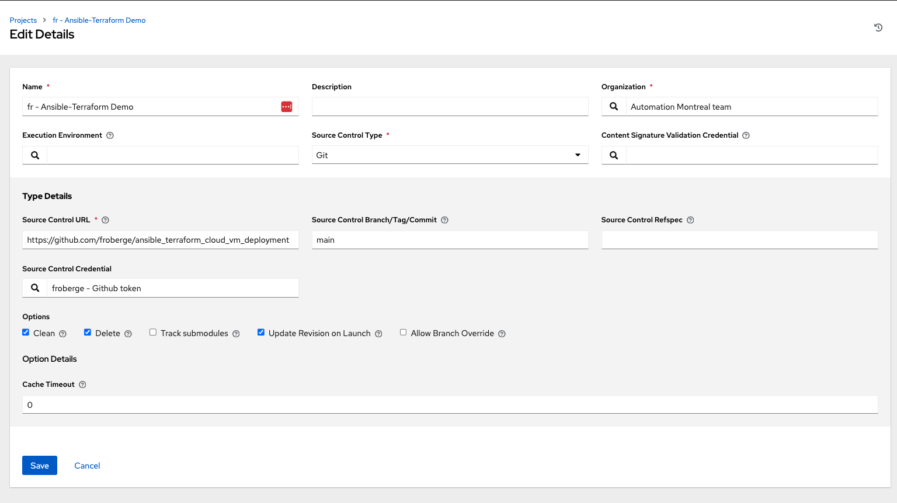
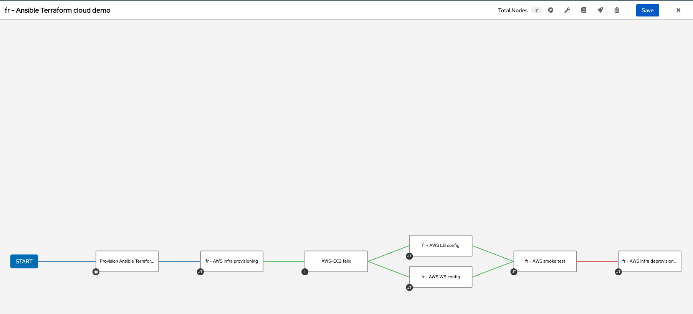

# Ansible Cloud App Deployment
Read this in other languages: :fr:[ French/Français](README.fr.md)

#### Objective

The purpose of this project is to show that Ansible and Terraform aren't competitor but ally. Using them together we will hightlight how easily you can automate your cloud infrastructure on the different cloud provider with minimal change to your automation code.

#### Ansible & Terraform 

Ansible and Terraform are both great automation tools which have different ways of looking at automation. Ochestrating them together make for a great solution in automations.

* [Terraform](https://www.terraform.io/)
  * Great at defining what the state of the infrstructure needs to be. The states get maintain in time.
  * Excels as a `cloud intrasctructure` provisioning tool
  * Define the entirety of the instrasctucture
* [Ansible](https://www.ansible.com/)
  * Task base oriented
    * easy way to get use to, since it translate to what we are doing on a day 2 day fashion
  * Great for orchestration multiple teams and technologies in to a single IT workflow. ex: Window, Linux, Network, API ....
  * Cross-domain automation solution

What does it look like together:


---
#### Demo

Using Ansible and Terraform we will be deploying VM(s) in the cloud in order to deploy a Web Application inside a Web Server. The demo contains a load balancer to sent traffic to the different VM and a interfacing with ServiceNow to act as the client portal to order the different VM. We could implement other element in serviceNow such as incident management and Inventory.


###### Infrastructure
For the complete demo we wil be using 3 cloud providers. The demo is build so you can elect to select only the cloud infrastructure you want.

* [AWS](https://aws.amazon.com/)
* [Microsoft Azure](https://azure.microsoft.com/en-ca)
* [Google Cloud Platform](https://cloud.google.com/)

###### Prerequisite
* For local development
  * _Ansible_ core 2.16.x
  * _Terraform_
  * Python 3.x
  * [Red Hat JBoss]()
* [Github](https://github.com/) 
* Fork of these 2 repos
  * [Ansible Terraform Cloud VM Deployment](https://github.com/froberge/ansible_terraform_cloud_vm_deployment)
  * [Ansible Terraform Config](https://github.com/froberge/ansible_terraform_config)
* [Ansible Automation Platform](https://www.redhat.com/en/technologies/management/ansible)
* _Optional_ [ServiceNow](https://www.servicenow.com/)


:warning: The required variable need to be set in order to create the load balancer in the proper cloud.[Set variable here]().

Implementation diagram:


---

#### Build the demo.

For the demo we need and execution environment, you can find the info on how to [create and execution environment here](../exec-environment/README.md). You can also find an already compile version [here](https://quay.io/repository/froberge/ansible-terraform-demo).


##### General Steps

* In `Ansible Automation Platform` create e new Credential Types to contain you Github Personal Access token. as follow.

You can use these values to populate the fields.
  * input configuration ( in yaml)
    ```script
      fields:
      - id: git_user
        type: string
        label: Username
      - id: git_token
        type: string
        label: Token
        secret: true
      - id: pah_pass
        type: string
        label: Vault Password
        secret: true
    required:
      - username
      - password
      - pah_pass
    ```
  * Injector configuration ( in yaml )
    ```script
    env:
    git_user: '{{ git_user }}'
    pah_pass: '{{ pah_pass }}'
    git_token: '{{ git_token }}'
    ```

* Create a `Personal Access tokens` on your GitHub account. You can create a token under your account _settinggs -> Developer Settings_
Great the token with the name you want, with the following credential, and the expiration date you desire.

:warning: Copy the generated key, you will need in another step.

* Create the new Credential from the new type you just created with the `Personal Access tokens`


* Create a project that point to the Source Control, Once this is done you are now ready to create the different templates needed



##### Setting up each cloud provider.

###### AWS
The AWS scenario is created using Terraform and Ansible.

* Create a Credential which contains your AWS credentials


* Ansible connects to EC2 instance using SSH. Let's start by creation a new [Key pair in AWS](https://docs.aws.amazon.com/servicecatalog/latest/adminguide/getstarted-keypair.html). 

  * Create key pair, call `ansible_terraform_demo` in your AWS account.
  
  :warning: if you change the name you need to edit the terraform main  file with the new name.

  * Create a credential of `type machine in AAP` which contains the SSH key for the user `ec2-user`
  

* 1. Configure [AWS dynamic inventory](https://www.redhat.com/en/blog/configuring-an-aws-dynamic-inventory-with-automation-controller)


* Create the different templates needed in order to create the required workflow.



Provisioning or Deprovisioning variables
```script
---
infra_state: [present / absent]
force_init: true
git_repo_url: https://{{ git_user }}:{{ git_token }}@github.com/froberge/ansible_terraform_config.git
git_work_dir: /tmp/terraform/aws
```

LoadBalancer, Smoke test & WS variables. ( WS only need the second variable)
```script
---
lb_group_name: tag_type_dev_lb
ws_group_name: tag_type_dev_web
```

###### Azure
The Azure scenario is created using only Ansible.


---
